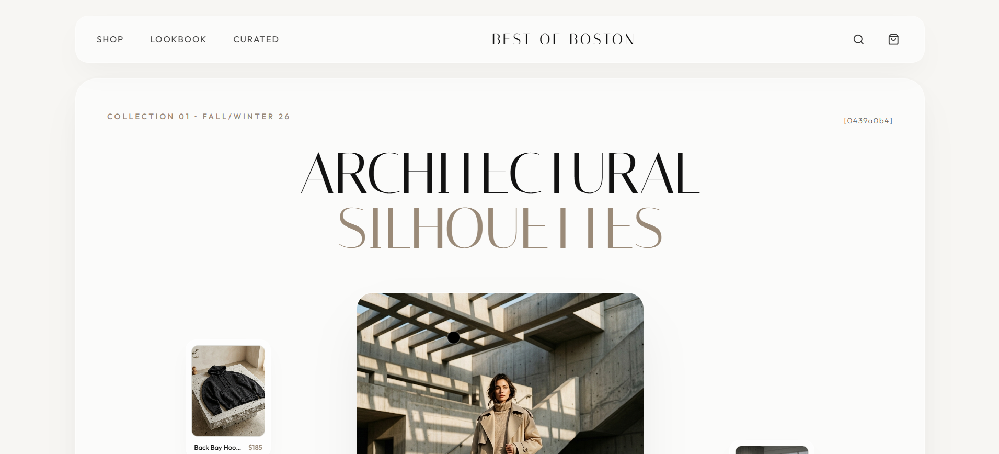
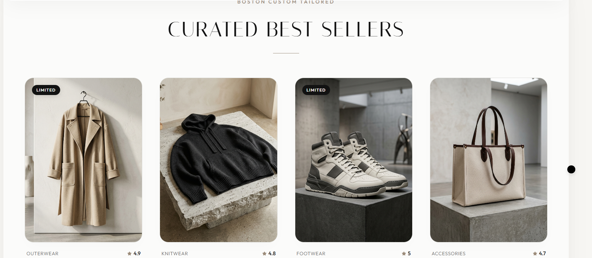
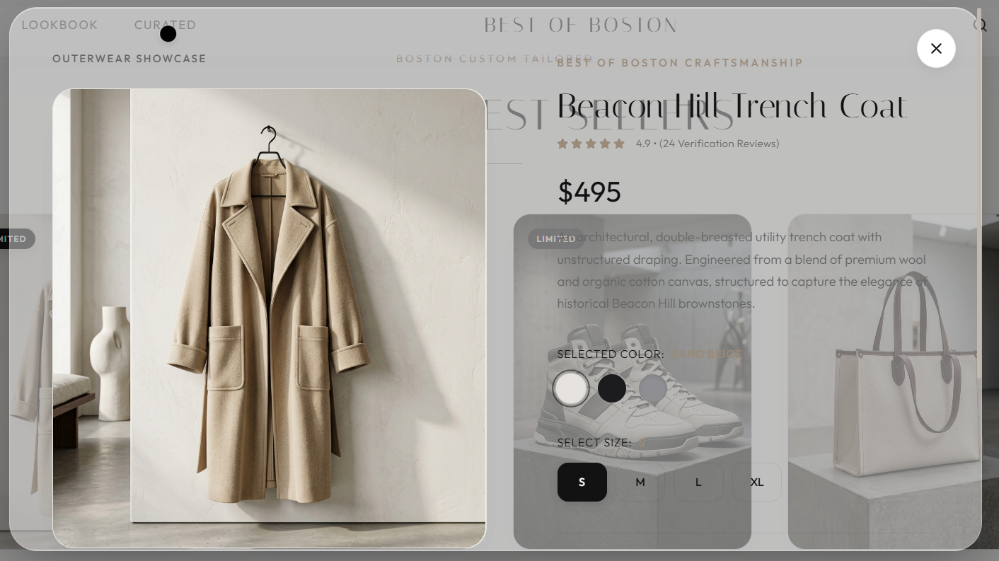

<div align="center">

# 🖤 Best of Boston

### Luxury Streetwear, Engineered as a Digital Experience

[](https://best-of-boston-live.vercel.app/)
[](https://react.dev/)
[](https://vitejs.dev/)
[](https://gsap.com/)
[](https://www.framer.com/motion/)

</div>

---

## Overview

**Best of Boston** is a premium **luxury ecommerce experience** built for a Boston-based streetwear brand. The project presents engineered, architectural garments through an editorial-style storefront — combining a cinematic hero, curated collections, a best-sellers showcase, and a fully functional shopping cart into one cohesive, high-end frontend.

Designed to feel like a digital flagship store, Best of Boston serves as a portfolio piece exploring how **modern ecommerce UI** can deliver a **luxury brand experience** through motion, typography, and refined interaction design.

---

## Preview                                                                                                   




## Features

- 🛍️ **Functional Shopping Cart** — add, update quantity, and remove items, with cart state persisted via local storage
- 🪟 **Sliding Mini-Cart Panel** — reviews selected items without leaving the current page
- 🔍 **Product Details Drawer** — high-fidelity product view with size and color selection
- 🖱️ **Custom Cursor** — luxury follow-cursor interaction throughout the site
- 🧭 **Floating Navigation Bar** — persistent navbar with live cart item count
- 🎬 **Cinematic Hero Section** — bold brand-led landing visual
- 🗂️ **Collections Showcase** — curated presentation of product collections
- ⭐ **Best Sellers Grid** — interactive product grid with direct add-to-cart and detail view
- 🏛️ **Architectural Footer** — structured closing section reinforcing brand identity

---

## Design Highlights

- **Editorial Typography Pairing** — Italiana serif for high-end headings paired with Outfit for clean, modern body text
- **Glassmorphism Sections** — translucent "glass" containers that animate into view as the user scrolls
- **Scroll-Driven Motion** — GSAP ScrollTrigger powers smooth fade-and-rise reveals for each section
- **Micro-Interactions** — Framer Motion handles modal and drawer transitions for the product details view
- **Architectural Visual Language** — clean lines, structured grids, and a refined dark palette evoke "engineered luxury"

---

## Tech Stack

| Category | Technology |
|---|---|
| Framework | React 19 |
| Build Tool | Vite 8 |
| Animation | GSAP (ScrollTrigger) + Framer Motion |
| Icons | Lucide React |
| Fonts | Italiana, Outfit |
| State Persistence | Local Storage (cart) |

---

## User Experience

Every interaction in Best of Boston is designed to feel deliberate and premium. The custom cursor and floating navbar establish an immersive tone from the first scroll, while GSAP-driven reveals give each section — Collections, Best Sellers, and the Footer — a sense of arrival rather than abrupt appearance. The shopping flow is kept frictionless: products can be explored in a detailed drawer with size/color options, added to a persistent cart, and reviewed instantly via the sliding mini-cart, all without page reloads or jarring transitions.

---

## Performance & Responsiveness

Built on **Vite** for fast builds and instant dev refresh, Best of Boston is **fully responsive across desktop, tablet, and mobile**. Scroll-triggered animations are scrubbed smoothly to avoid jank, and the cart state persists across sessions via local storage — ensuring a consistent, premium experience regardless of device or screen size.

---

## Live Demo

🔗 **[best-of-boston-live.vercel.app](https://best-of-boston-live.vercel.app/)**

---

## Repository

🔗 **[github.com/ShibamPandab/Best-of-Boston](https://github.com/ShibamPandab/Best-of-Boston)**

---

## Installation

```bash
# Clone the repository
git clone https://github.com/ShibamPandab/Best-of-Boston.git

# Move into the project directory
cd Best-of-Boston

# Install dependencies
npm install

# Start the development server
npm run dev
```

The app will be available at `http://localhost:5173` by default.

---

## Author

**Shibam Pandab**
🔗 [GitHub Profile](https://github.com/ShibamPandab)

---

## SEO Keywords

`Luxury Ecommerce Website` · `Premium Product Showcase` · `Modern Ecommerce UI` · `Luxury Brand Experience` · `Frontend Ecommerce Design`

---

<div align="center">

*Crafted with React, GSAP & Framer Motion — a premium frontend showcase project.*

</div>
